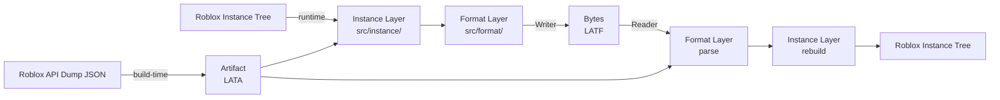
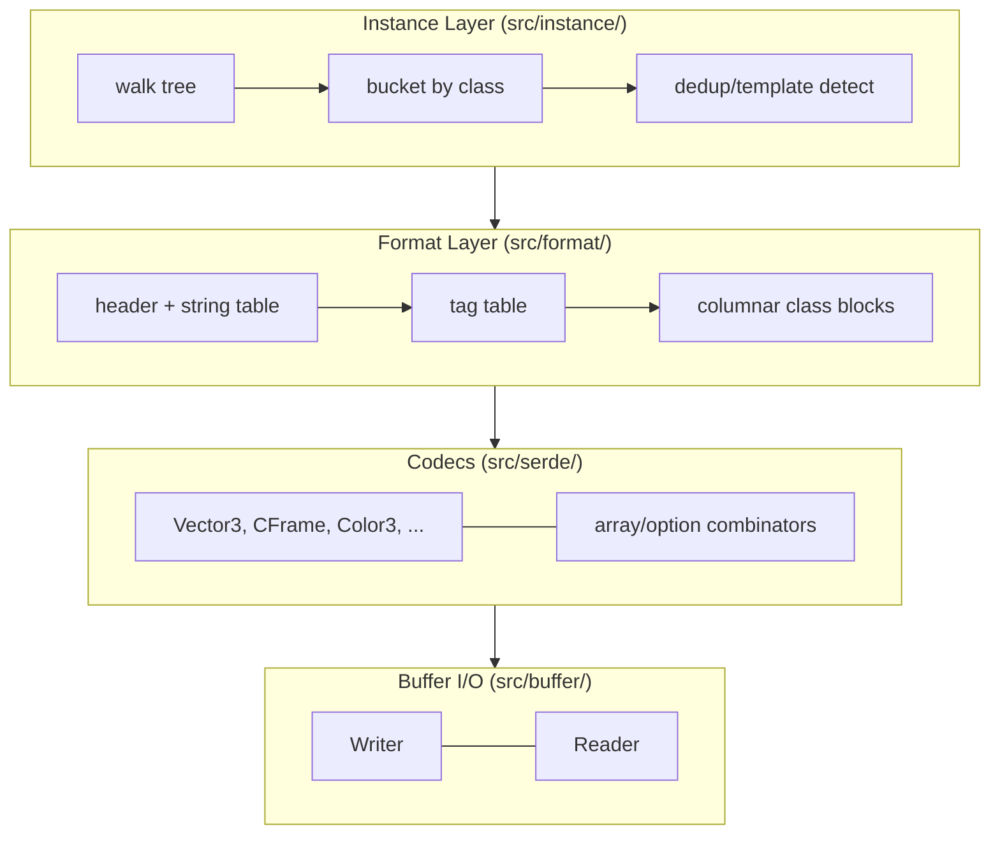
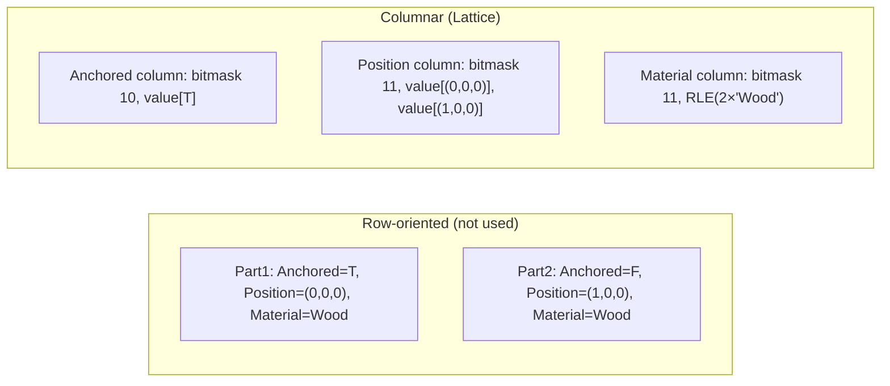

# How Lattice Works

A guided tour of the pipeline, for authors who want the mental model before
diving into `src/`. Each section links to the deeper reference doc.

## The pipeline, end to end

Two things get built once, ahead of time (top path): the **artifact** is
compiled from Roblox's API dump and never touches an actual Instance. Two
things happen every save/load (bottom path): the **instance layer** walks a
real Instance tree and the **format layer** packs/unpacks the bytes.

## The four layers

Each layer only knows about the one below it. Codecs never call each other
(except the two combinators). This is what lets 27 codecs live as
20-line files and be developed in parallel — see
[Key Design Decisions in CLAUDE.md](../CLAUDE.md#key-design-decisions).

- **Buffer I/O** — [glossary: varint](glossary.md#varint) is the one idea worth
  understanding here; everything else is `u8`/`f32`/etc.
- **Codecs** — one Luau module per Roblox type, `{write, read}`. See
  `src/serde/init.luau` for the full registry.
- **Format layer** — the on-disk container: header → string table → tag table
  → class blocks. Fully dissected in
  [examples/format-binary.md](examples/format-binary.md).
- **Instance layer** — turns a live Instance tree into the class-bucketed
  columns the format layer expects, and back again.

## Why columnar, why bitmasks

The single biggest size/speed win in Lattice is storing **properties as
columns, not instances as rows**, combined with **skipping default values**.

Grouping by property makes three optimizations possible that row-oriented
layout blocks entirely:

1. **Default elision** — a bitmask marks which instances even have a
   non-default value; defaults cost 1 bit, not a full serialized value.
   → [glossary: bitmask](glossary.md#bitmask), [examples/bitmask.md](examples/bitmask.md)
2. **RLE** — repeated non-default values (200 fence parts all `Material =
   "Wood"`) collapse to one `(count, value)` pair.
   → [glossary: RLE](glossary.md#rle-run-length-encoding), [examples/rle.md](examples/rle.md)
3. **Future delta encoding** — reserved encoding tag for gradually-changing
   columns (stacked parts' Y-coordinate). Not yet implemented.

Side-by-side byte counts for a concrete 3-part scenario:
[examples/columnar-vs-row.md](examples/columnar-vs-row.md).

## Reading a file, top to bottom

1. Read header → magic `LATF`, version, string table count.
2. Read string table → interned class/property names.
3. Read tag table → class ID → name, so a reader can inspect a file without
   an artifact.
4. For each class block: look up the class in the **artifact** (property
   list, codec IDs, default values), then for each property column: read the
   encoding tag, read the bitmask, decode raw or RLE values, and expand the
   bitmask back into one value per instance (defaults filled in for 0-bits).

Full pseudocode and an annotated hex dump: [examples/format-binary.md](examples/format-binary.md).

## Where to go next

| Question | Doc |
|---|---|
| What does term X mean? | [glossary.md](glossary.md) |
| What do the actual bytes look like? | [examples/format-binary.md](examples/format-binary.md) |
| Why columnar over row-oriented? | [examples/columnar-vs-row.md](examples/columnar-vs-row.md) |
| How does varint/bitmask/RLE encode? | [examples/](examples/) |
| What's the artifact system design? | [superpowers/specs/2026-07-04-artifact-system-design.md](superpowers/specs/2026-07-04-artifact-system-design.md) |
| What's the format layer design? | [superpowers/specs/2026-07-04-format-layer-design.md](superpowers/specs/2026-07-04-format-layer-design.md) |
| What's the codec benchmark design? | [superpowers/specs/2026-07-02-codec-benchmarks-design.md](superpowers/specs/2026-07-02-codec-benchmarks-design.md) |
